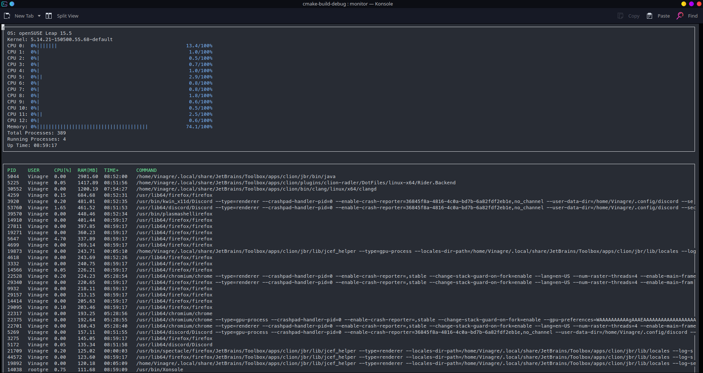

# Capstone Project

This is my final project for the Udacity C++ nanodegree program.

I changed the system monitor project to run concurrently using threads
and memory management.

## Instructions

1. Clone the project repository: `git clone https://github.com/udacity/CppND-System-Monitor-Project-Updated.git`

2. Build the project: `make build`

3. Run the resulting executable: `./build/monitor`

4. Follow along with the lesson.

5. Implement the `System`, `Process`, and `Processor` classes, as well as functions within the `LinuxParser` namespace.

6. Submit!

## Rubric Points
### Loops, Functions, I/O 
Through all the code is possible see a variety of control structures, data structures and immutables variables
and the code is clearly organized into functions.

The class LinuxParser is responsible for reading data from the computer system.
And the ncurses class handles the display of processed data on the terminal.

### Object Oriented Programming
Inside LinuxParser.cpp and System class can be seen a lot of those criteria.

### Memory Management
Smart prts inside System.h

Move operation inside Process.cpp in the definition of the Process constructor.

Memory management is best seen too in LinuxParse.cpp, in the functions: Pids and ProcStatParsin

### Concurrency
Concurrency is used to separate in threads the collection and process of the system data. Localized in ncurses_display.cpp inside
the while loop.

In the System class there is a method called UpdateSystemMutex that lock_guard the collection of data that is being saved
in the system object. It is used on ProcStatParsin(), UpTime(), Pids() and MemoryParse() functions in LinuxParse.cpp

Print of the result.

Print of the starting system monitor

